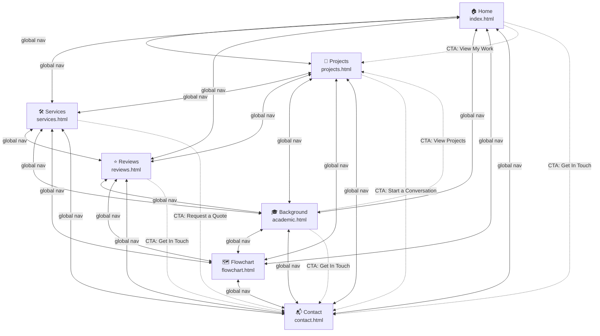

# web-portofolio-technical-writing-course

**Elevate your products to the next level**

A portfolio website for **Usef Mohamed** — full-stack developer specialising in intelligent web applications and data-driven business solutions.

---

## Site Structure Flowchart

> **Legend**
> - `↔` Solid bidirectional arrows = global navigation bar (every page ↔ every page)
> - `⇢` Dashed arrows = inline call-to-action buttons

---

## Pages

| Page | File | Description |
|------|------|-------------|
| 🏠 Home | `index.html` | Hero, stats strip, featured projects, CTA banner |
| 📁 Projects | `projects.html` | Full portfolio of 8 delivered projects |
| 🛠️ Services | `services.html` | 9 service cards + 4-step process |
| ⭐ Reviews | `reviews.html` | 6 client testimonials + rating summary |
| 🎓 Background | `academic.html` | Technical skills grid + B.Sc. education |
| 🗺️ Flowchart | `flowchart.html` | Interactive site-structure diagram (this flowchart, rendered) |
| 📬 Contact | `contact.html` | Contact form + FAQ + direct email |

